
# a14g-final-submission

    * Team Number: 03
    * Team Name: Super Hotpot
    * Team Members: Jinyu Hua, Lixi Jiang
    * Github Repository URL: https://github.com/ese5160/a14g-final-submission-s25-t03-hotpot.git
    * Description of test hardware: SAMW25

## 0. Pages

https://ese5160.github.io/a14g-final-submission-s25-t03-hotpot/

## 1. Video Presentation

Please refer to the link below:
https://drive.google.com/file/d/1GpJeau-O78zI6oE7ogSVTM1Llvrdl-aD/view?usp=share_link

## 2. Project Summary

- Device description:

    This project is an Internet-connected smart alarm clock that displays world time, weather updates, countdowns, and personalized to-do lists on an LCD screen. It also features an ambient light sensor to automatically turn on a light when the environment is dark.

    We were inspired by the fact that as lazy people, we struggle to achieve self-discipline in our lives, and designed this alarm clock to help people turn off their alarms with some movement and leave their phones to study and work at regular intervals.

    The device connects to the Internet via Wi-Fi and communicates with a Node-RED dashboard to receive real-time weather data, synchronize time zones, and fetch task lists—enhancing its utility far beyond a conventional alarm clock.

- Device Functionality：

    The smart alarm clock uses a Wi-Fi-enabled microcontroller to receive data from a Node-RED server and display it on an LCD screen. Users can interact with the system remotely through a web dashboard.

    Key components:
    
    Microcontroller: SAMW25 for Wi-Fi and peripheral control

    Actuators:
    LCD Display: RA8875 driver-based TFT for visual output
    Buzzer: SMT-0540-S-R for audible alarms
    LED: Lights up when darkness is sensed

    Sensors:
    Light Sensor: PDV-P8103 photoresistor to detect ambient brightness to trigger lighting
    IMU: ADXL345 that senses actions to stop the alarm
    RTC: DS3231MZ+TRL for real time clock
    Buttons: 2 B3F-1070 to scroll the main menu

    System Block Diagram:
    
    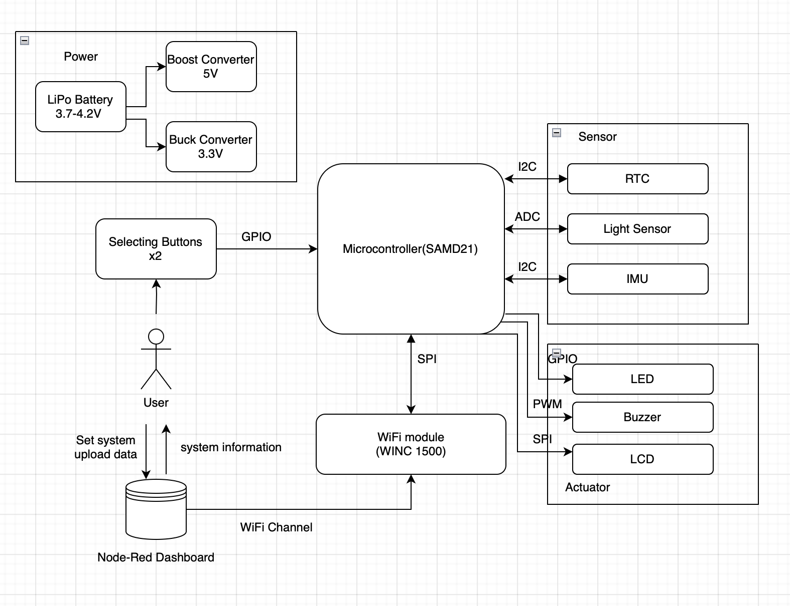

- Challenges:

    Hardware:
    
    1. We did not really considered the limited space of the physical board that we cannot fit in all the components at first.
    - We rearranged everything ont the board, spending extra time.

    2. One of our board has manufacturer issue with USB.
    - We gave up the board for final submission, only used it for testing.

    3. Two of our boards' ADC were not working.
    - We gave up the boards and only used them for testing.

    4. We planned 3 buttons at first and randomly chose 3 GPIO, but it turned out that two of them are actually using the same external interrupt channel.
    - We changed our user design. We were planning one button for scrolling to right, one to left and one to click to choose. We deleted the leftward function and everything worked well.

    Firmware:

    1. The I2C was not working correctly with Wifi at first.
    - A small delay in the given code is added, and everything worked well after that.

    2. The LCD was totally new to us and we have no idea how to light it up.
    - We read the datasheet and made codebase for the LCD on our own. The LCD is actually the biggest problem in our project. In this process, we encountered a lot of problems like stack overflow and the missions simply get stuck. We tried many methods, like DMA and changing priorities. We are glad that the LCD finally worked well at last.

    3. We had problem with expanding our clock to a world clock.
    - We learned to use API and the problem was solved at last.

    Intergration:

    1. The LED Strip we planed to use was actually a SPI communication, and it needs a logic shifter for it needs a 4.2V signal while our MCU only gives a 3.3V output.
    - We changed it to a normal LED. We used to solder a logic shifter to our board but it made intergration very hard and the new SPI is kind of unstable and mess up with everything else. 

- Prototype Learning:

    What good things that were done:

    We are glad that I2C debugging connectors were added to our board and we did not gave them up to fit in evrything. This really helped a lot while we were debugging. We also added enough test points to our board so that we can easily find issues on our boards. Our final outer box for this project is also nicely done with 3D printing, which taught us a lot on Solidworks designings.

    What we should improve:

    We regret that we did not leave a hole for our debugger line to go through on the outer box. We should have made use of idle pins on the MCU so that we can still hold onto our button functions. 

    Overall we did a great job on prototype. But for if we have to build the device again for improvement, we will focus more on debugging. First, we will read datasheet more carefully. All these mistakes can be fixed by simply understanding the datasheet more deeply. Secondly, we will leave a way for our debugger line to go through, sothat we can rely more on the terminal to debug.

- Next Steps & Takeaways:

    To improve the project:

    We need to complete the OTAFU part. Though we can do it seperately through our code, it conflicts with following process if we intergrate them together. We can also try to make use of the LED Strip, find a faster logic shifter and try again. 

    What did we learn:

    Skills:

    Over the course of the semester, we gained a wide range of practical skills. We learned how to design printed circuit boards (PCBs) using Altium Designer and acquired foundational knowledge of FreeRTOS. We also developed strong hardware and software debugging skills — including how to use a logic analyzer, how to debug firmware effectively, and how to write code in a way that simplifies future debugging. In addition, we became more proficient at reading and interpreting datasheets, which was essential for understanding component specifications and integration. Although it wasn’t required, we also explored 3D modeling with SolidWorks, which proved to be extremely useful for prototyping and enclosure design

    Life Experience:

    Throughout the semester, we gained valuable experience in teamwork. Most of our assignments were completed collaboratively, and we often debugged and problem-solved together. We both received and offered help to our classmates, which fostered a strong sense of community. This experience truly taught us the meaning of “teamwork makes the dream work.” Moreover, we realized that kindness goes a long way — by being kind and supportive, we received the same in return. It was incredibly rewarding to be surrounded by so many kind and helpful people, including our TAs, professor and classmates.

- Project Links:

For Node-Red Dashboard:
http://74.235.31.208:1880/ui/

For final PCBA:
https://upenn-eselabs.365.altium.com/designs/2B2CFE7D-2491-4D54-B94B-FC7E0FEBA2F1#design

## 3. Hardware & Software Requirements

Hardware Requirements Specification (HRS):

HRS 01 - Project shall be based on SAMW25 microcontroller operating at 3.7-4.2V from Li-Ion battery.

HRS 02 - A 7-inch LCD should be used for user interface. 

HRS 03 - An IMU shall communicate via I2C bus for shake detection and gaming input.It should quickly react after reaching 8 shakes.

HRS 04 - A light sensor shall communicate via I2C bus for ambient light detection with range 1-2400.

HRS 05 - A LED shall provide ambient lighting, controlled by single GPIO pin.

HRS 06 - Two tactile buttons shall connect directly to GPIO pins for user input. It should react within 0.5s after being pressed.

HRS 07 - System shall include battery management and voltage regulation circuitry(3.3V buck and 5V buck-boost) for 3.7V Li-Ion battery. 

HRS 08 - A buzzer shall be used for alarm. It should be reacting in 0.5s.

HRS 09 - DS3231 RTC module shall communicate via I2C bus for accurate timekeeping. After a 4 hour test, it should be the same as the real time.

Though there are some changes to the original requirements, all these HRS have been met. All the 0.5s reaction time were included as 'waiting time can not be sensed by human' in our projects. The real time clock was tested to be running stably after 4 hours, with correct current time and pace.

Software Requirements Specification (SRS):

SRS 01 - The system shall display the current time fetched from the RTC module.

SRS 02 - The system shall display real-time temperature and weather information from the RTC module.

SRS 03 - The user shall be able to add, edit, and delete to-do items via the LCD interface with Node-Red Dashboard.

SRS 04 - Shaking the device several times with significant motion, detected via IMU, will dismiss the alarm in 0.5s.

SRS 05 - The system shall implement a multi-level menu structure navigable via 2 side buttons.

SRS 06 - When ambient light falls below 1000, the LED shall activate within 0.5s.

SRS 07 - Users shall set countdown timers with alarm sound at the end within 0.5s.

SRS 08 - The system shall respond to user input within 0.5s.

SRS 09 - Alarm and timer accuracy shall be within 1 second.

Though there are some changes to the original requirements, all these HRS have been met. All the 0.5s reaction time were included as 'waiting time can not be sensed by human' in our projects. Other general requirements can be valued by bare eyes.

## 4. Project Photos & Screenshots

- Final Project:

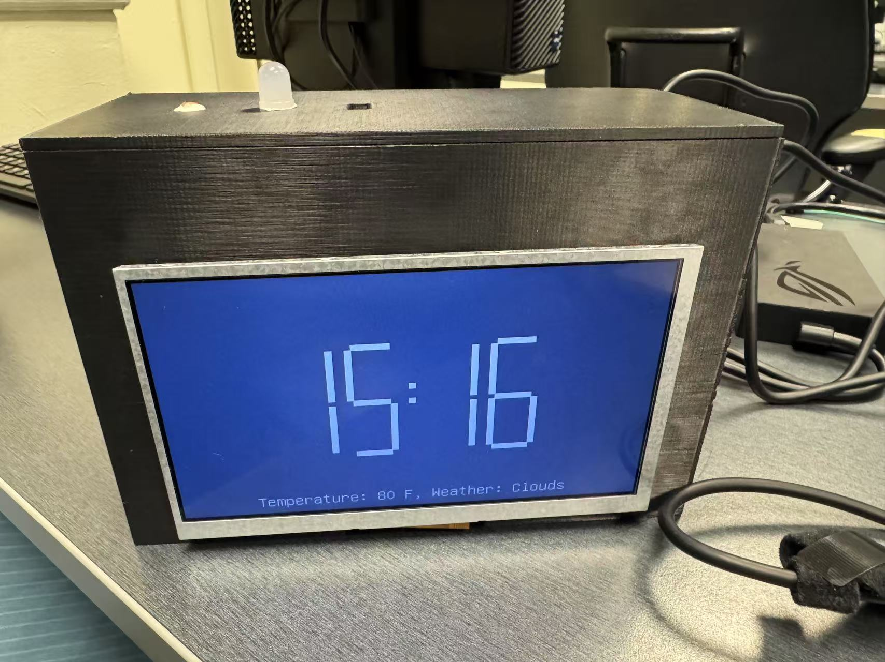

- PCBA top:

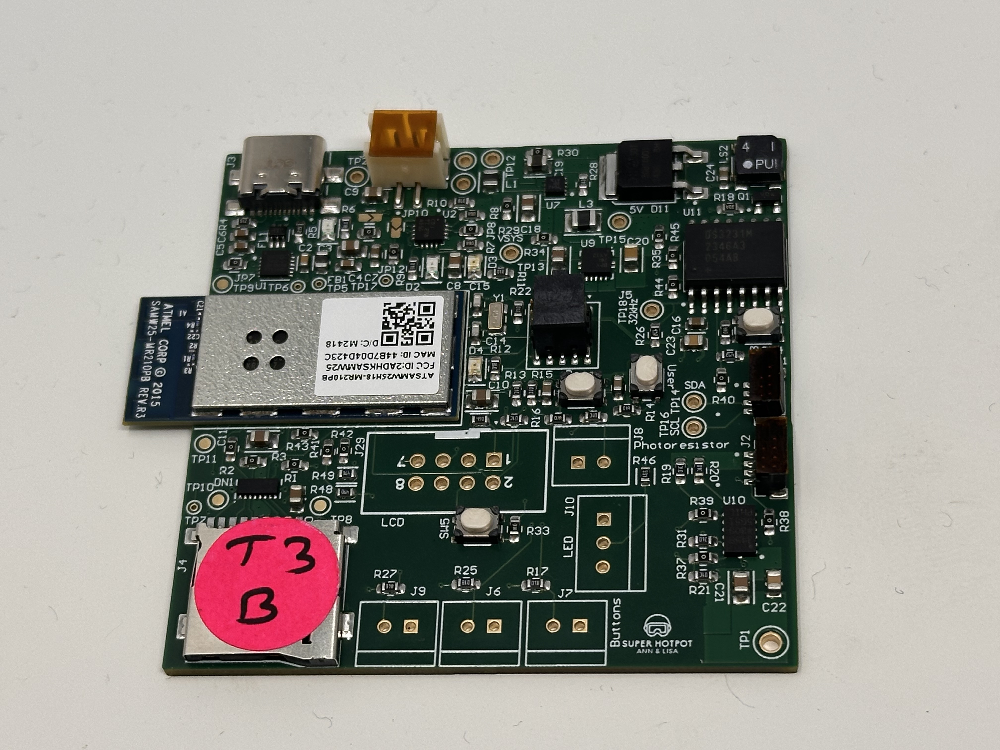

- PCBA bottom:

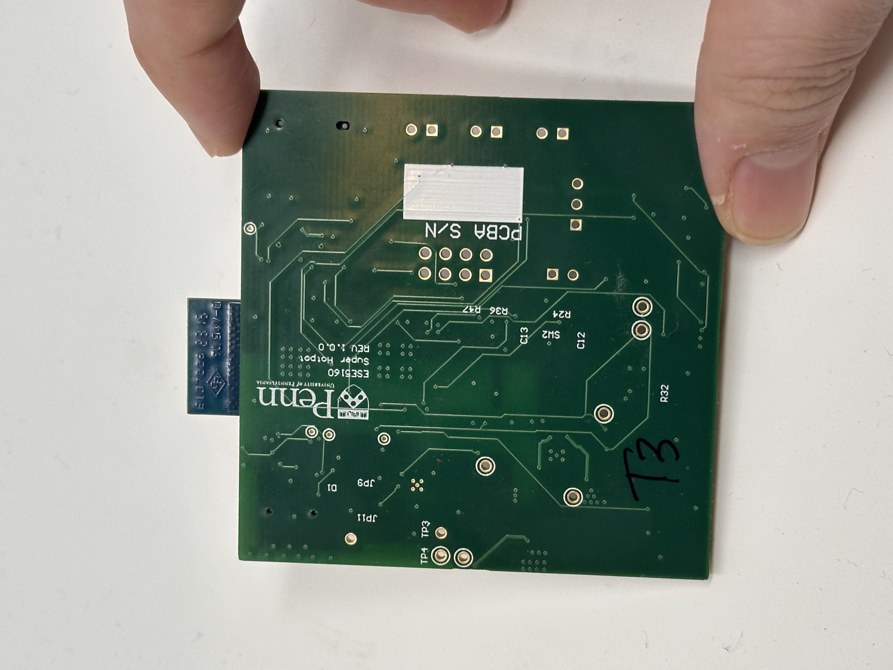

- PCBA running under load:

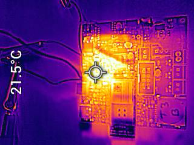

- The Altium Board design in 2D view:

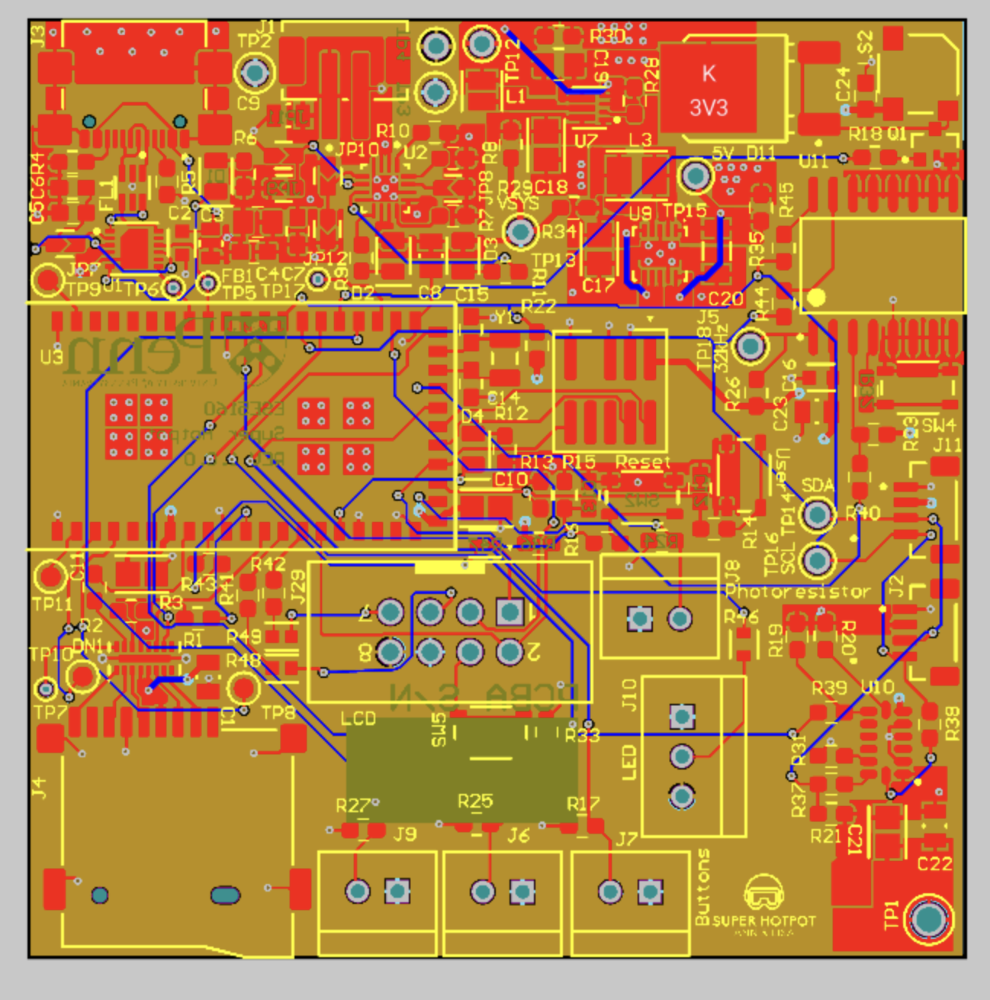

- The Altium Board design in 3D view:

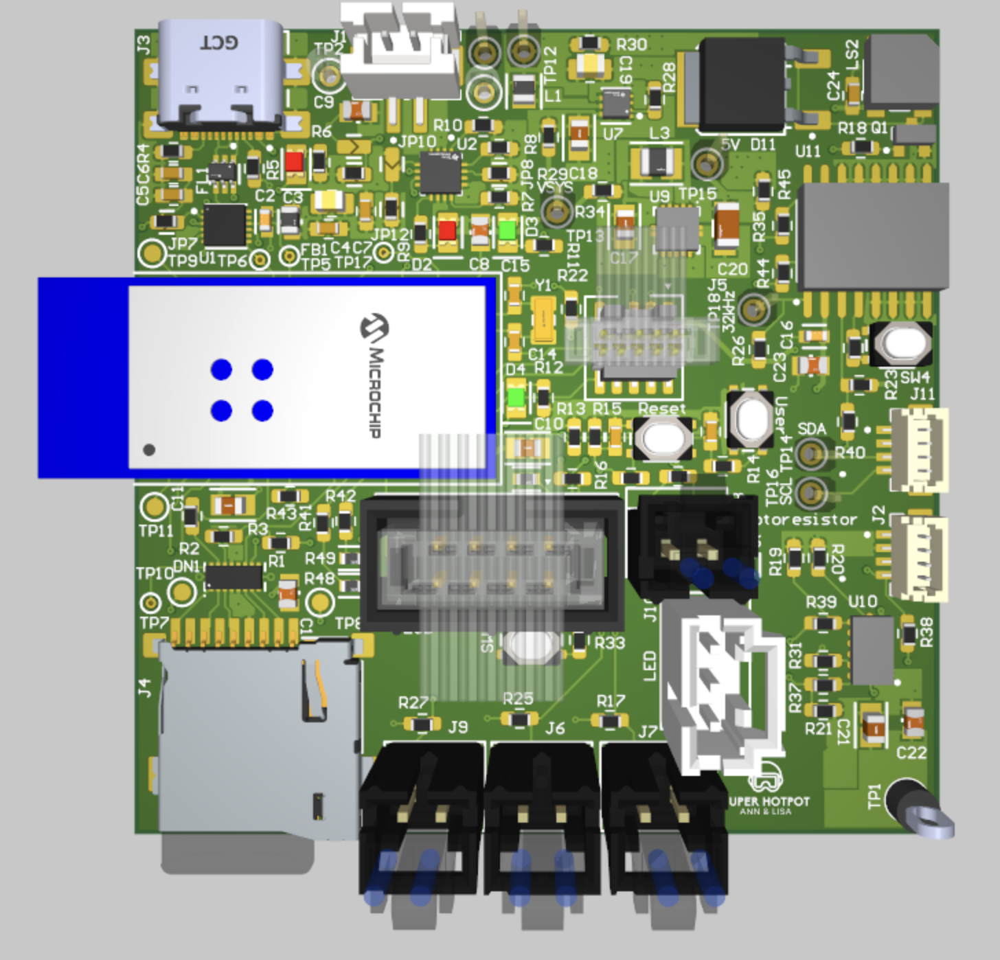

- Node-RED dashboard:

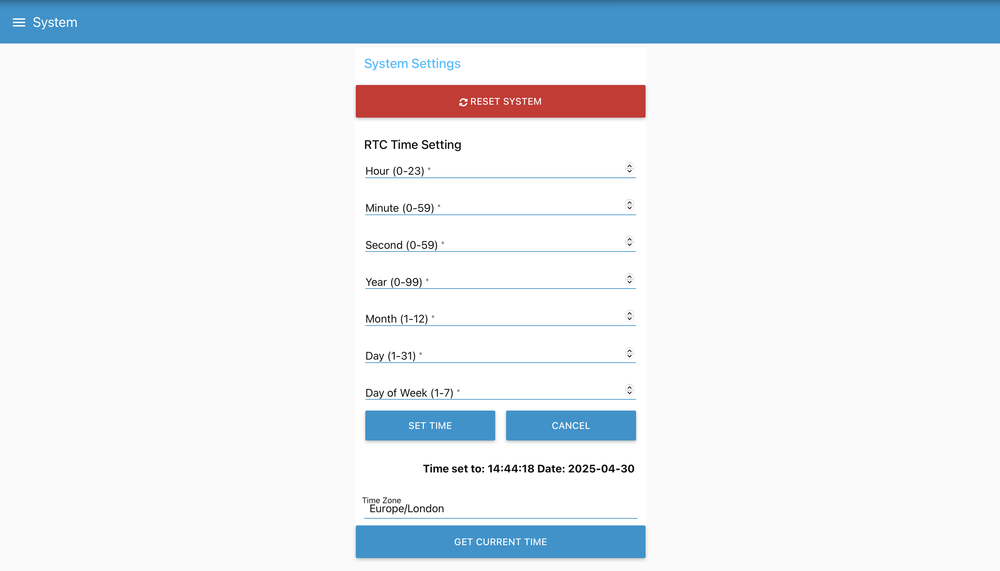

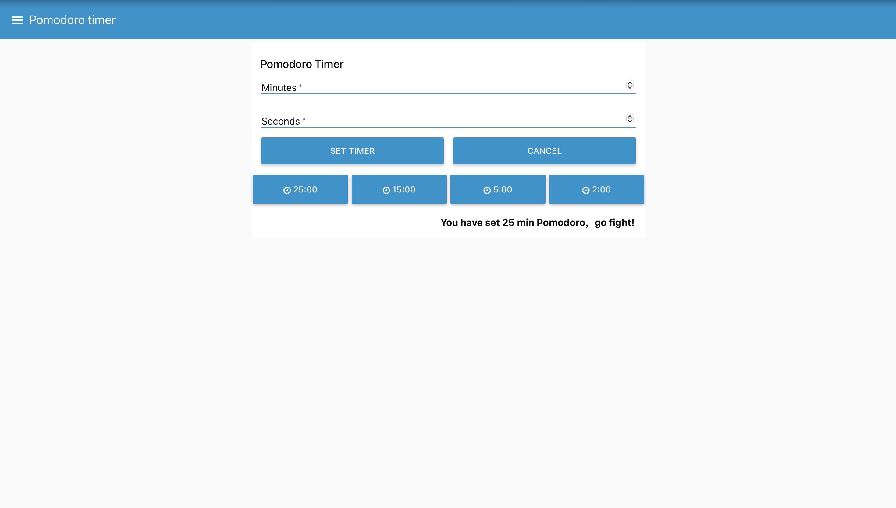

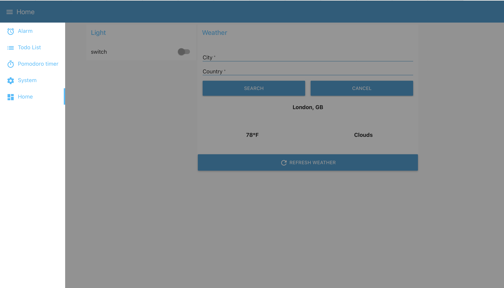

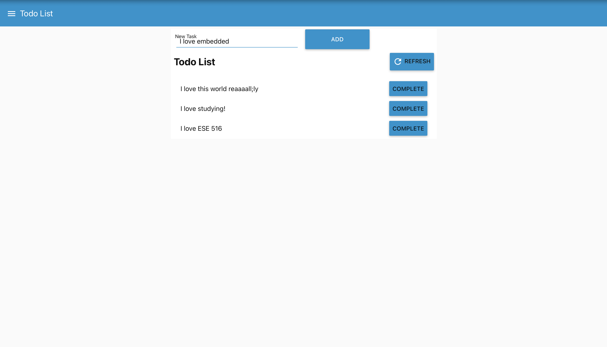

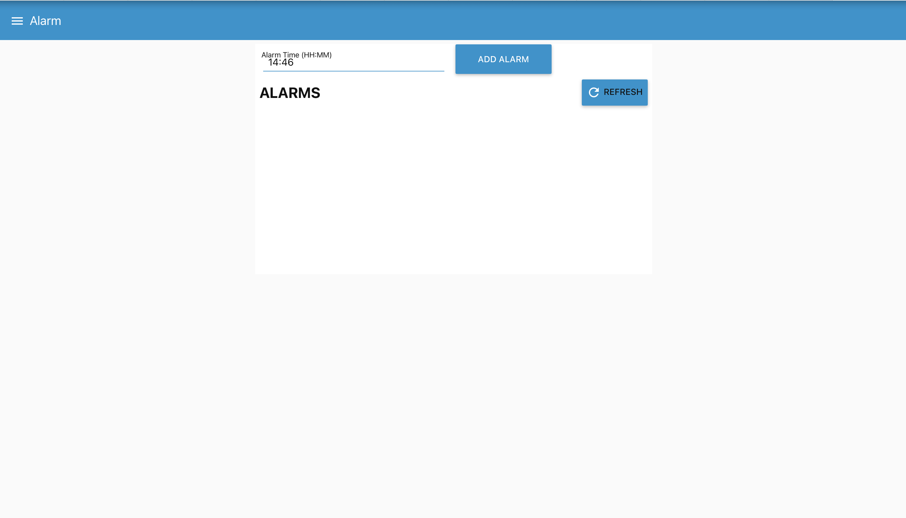

- Node-RED backend:

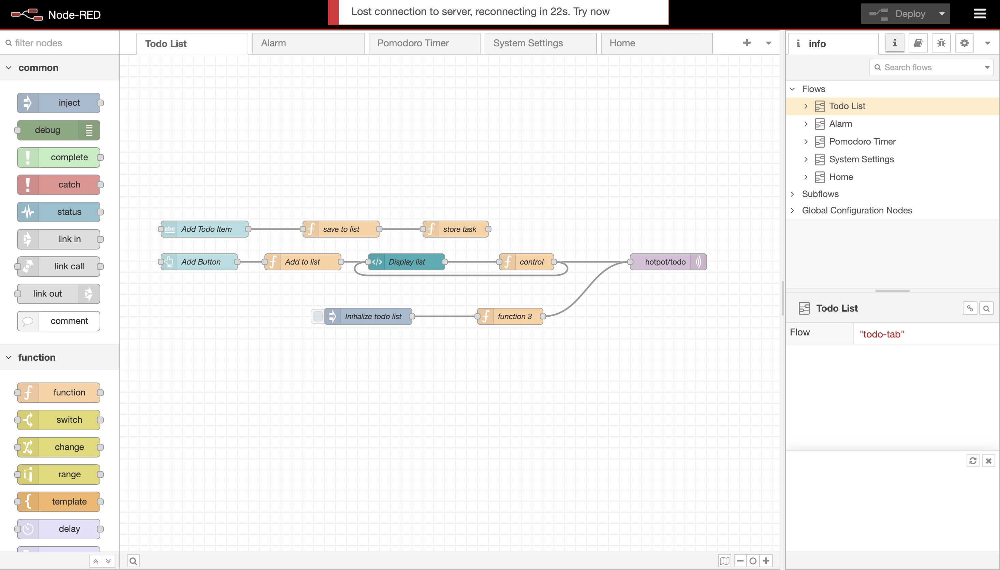

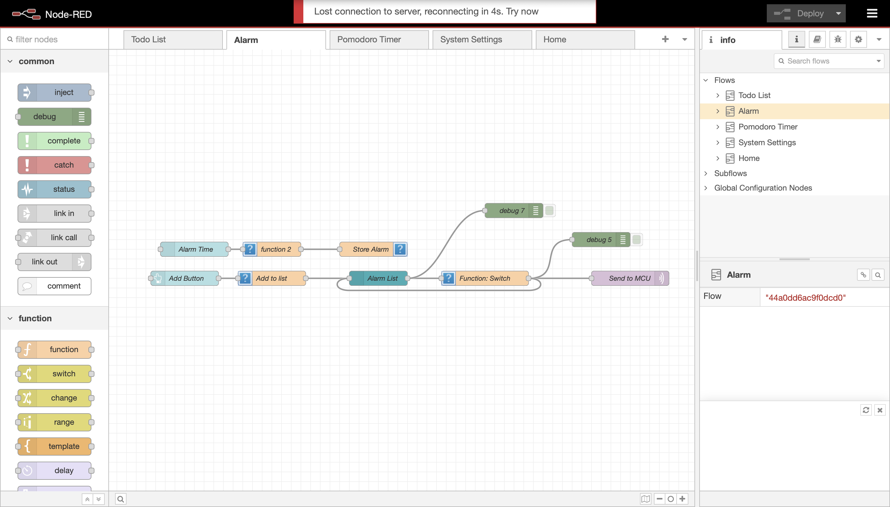

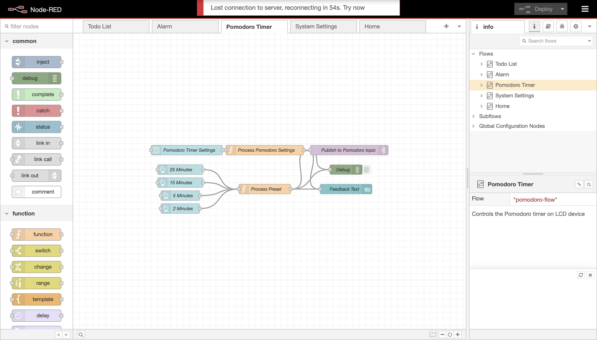

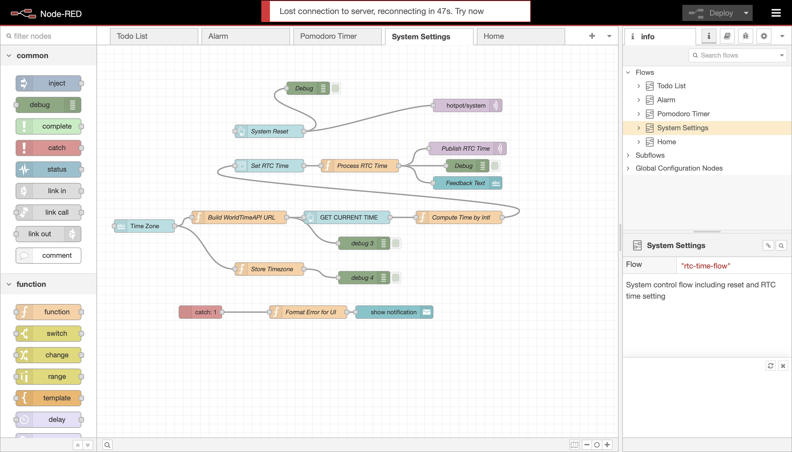

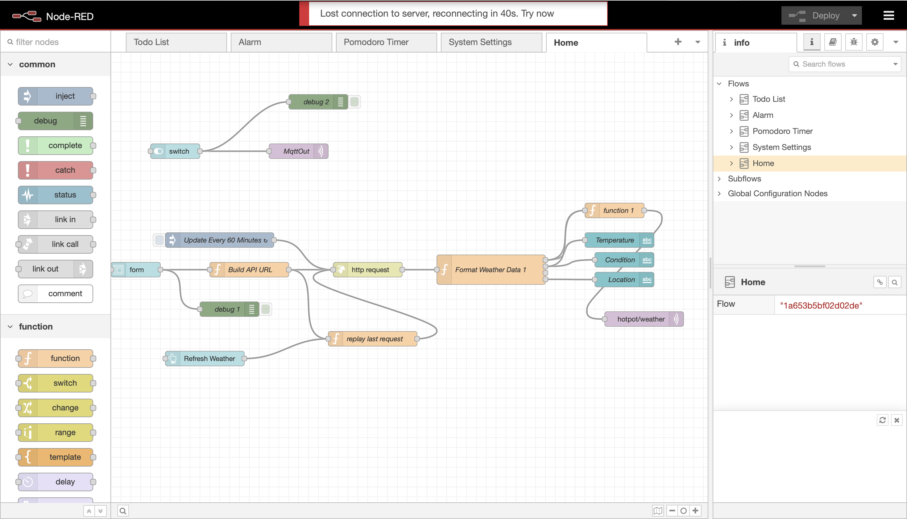

- System Block Diagram:
    

## Codebase

- A link to your final embedded C firmware codebases: https://github.com/LixiJiang/T03_Codebase.git
- A link to your Node-RED dashboard code: http://74.235.31.208:1880
- Links to any other software required for the functionality of your device: None

